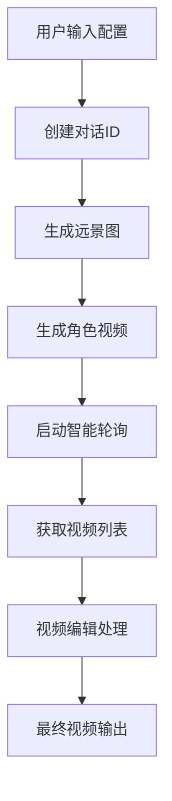

# 增强对话视频功能文档

## 功能概述

增强对话视频功能是基于原有对话视频生成的扩展版本，新增了以下核心功能：

1. **实时加载状态显示** - 提供详细的生成进度和状态反馈
2. **智能视频列表管理** - 分别展示角色A和角色B的生成视频
3. **集成视频编辑工具** - 内置视频剪切和拼接功能
4. **智能轮询机制** - 高效获取API生成的视频数据
5. **优化的用户体验** - 响应式设计和直观的操作界面

## 页面访问

- **路由路径**: `/video-generation/enhanced-dialogue`
- **页面标题**: "增强对话视频"
- **位置**: 视频生成模块下

## 功能详解

### 1. 智能加载状态显示

#### 特性
- **进度条显示**: 实时展示当前生成进度
- **状态消息**: 详细的操作状态描述
- **分阶段提示**: 从准备到完成的全过程状态

#### 实现
```vue
<div v-if="isLoading" class="loading-status">
  <div class="loading-indicator">
    <t-loading size="large" />
    <div class="loading-text">{{ loadingMessage }}</div>
    <div class="loading-progress">
      <t-progress :percentage="loadingProgress" :show-info="true" />
    </div>
  </div>
</div>
```

### 2. 角色视频列表管理

#### 角色A视频列表
- 显示角色A生成的所有视频
- 每个视频显示标题、预览和操作按钮
- 支持视频编辑和下载

#### 角色B视频列表
- 显示角色B生成的所有视频
- 与角色A列表功能相同
- 独立管理和操作

#### 视频项结构
```typescript
interface VideoItem {
  url: string;           // 视频URL
  title?: string;        // 视频标题
  content?: string;      // 对话内容
  file?: File;          // 文件对象（可选）
  blob?: Blob;          // Blob对象（可选）
}
```

### 3. 集成视频编辑工具

#### 3.1 视频剪切工具 (`VideoCutTool.vue`)

**功能特性**:
- 支持精确时间控制（秒级）
- 多种编码模式选择
- 实时预览和结果展示
- 进度追踪和错误处理

**使用方法**:
1. 选择要编辑的视频
2. 设置开始和结束时间
3. 选择输出格式和编码模式
4. 执行剪切并预览结果

**编码模式**:
- **快速模式**: 保持原编码，处理速度快
- **精确模式**: 重新编码，质量可控
- **时间轴模式**: 推荐模式，平衡速度和质量

#### 3.2 视频拼接工具 (`VideoMergeTool.vue`)

**功能特性**:
- 支持多视频选择和排序
- 智能拼接顺序管理
- 转场效果配置
- 质量和格式设置

**使用方法**:
1. 从角色A和角色B视频中选择要拼接的视频
2. 调整拼接顺序
3. 配置拼接设置（格式、质量、转场等）
4. 执行拼接并下载结果

**快速排序选项**:
- **按对话顺序**: 角色A在前，按内容顺序排列
- **按角色分组**: 先A后B，同角色内按顺序
- **交替排列**: A和B角色交替出现

### 4. 智能轮询机制

#### 核心特性
- **智能退避策略**: 动态调整轮询间隔
- **进度反馈**: 实时更新轮询状态
- **错误恢复**: 自动重试和错误处理
- **资源管理**: 支持轮询中止和清理

#### 使用示例
```typescript
import { pollRoleAVideos } from '@/utils/smartVideoPolling';

const polling = pollRoleAVideos(dialogId, {
  onProgress: (attempt, maxAttempts, message) => {
    console.log(`进度: ${attempt}/${maxAttempts} - ${message}`);
  },
  onDataChange: (videos, content) => {
    // 处理新的视频数据
    updateVideoList(videos, content);
  },
  config: {
    maxAttempts: 30,
    initialInterval: 3000,
    enableBackoff: true
  }
});

// 启动轮询
await polling.start();
```

### 5. API集成

#### 使用的API接口

1. **创建对话**: `createAIGCDialog`
2. **生成远景图**: `operateAIGCDialogGenFarImg`
3. **生成对话视频**: `operateAIGCDialogGenVideo`
4. **获取对话状态**: `getAIGCDialog`
5. **试听音频**: `tryAIGCDialogAudio`

#### 数据流程



## 技术实现

### 核心技术栈
- **Vue 3**: 响应式框架
- **TypeScript**: 类型安全
- **TDesign**: UI组件库
- **FFmpeg.wasm**: 视频处理
- **智能轮询**: 状态管理

### 关键文件结构
```
src/pages/video-generation/
├── enhanced-dialogue-video.vue          # 主页面
├── components/
│   ├── VideoCutTool.vue                 # 视频剪切工具
│   └── VideoMergeTool.vue               # 视频拼接工具
└── ...

src/utils/
├── smartVideoPolling.ts                 # 智能轮询工具
├── videoProcessor.ts                    # 视频处理工具
└── advancedVideoProcessor.ts            # 高级视频处理
```

### 状态管理

#### 主要状态
```typescript
// 基础配置
const videoCollection = ref('chinese-dialogue');
const videoName = ref('');
const scenePrompt = ref('');

// 角色配置
const roleA1 = ref('');
const roleA2 = ref('');
const voiceTypeA = ref('BV700_V2_streaming');
const voiceSpeedA = ref(1.0);

// 加载状态
const isLoading = ref(false);
const loadingMessage = ref('');
const loadingProgress = ref(0);

// 视频数据
const roleAVideos = ref<VideoItem[]>([]);
const roleBVideos = ref<VideoItem[]>([]);
const currentDialogId = ref('');
```

## 用户操作流程

### 基本流程

1. **配置对话内容**
   - 输入视频名称和场景描述
   - 配置角色A的对话内容和音色
   - 配置角色B的对话内容和音色

2. **生成视频**
   - 点击"生成角色A视频"或"生成角色B视频"
   - 系统自动创建对话ID并开始生成
   - 智能轮询监控生成状态

3. **视频管理**
   - 查看生成的视频列表
   - 预览视频内容
   - 下载原始视频

4. **视频编辑**
   - 选择视频进行剪切编辑
   - 配置多个视频进行拼接
   - 下载编辑后的视频

5. **最终生成**
   - 生成完整的对话视频
   - 整合所有编辑内容

### 高级功能

#### 视频剪切
1. 选择要剪切的视频
2. 设置开始和结束时间
3. 选择编码模式和质量
4. 执行剪切并预览结果

#### 视频拼接
1. 选择多个视频文件
2. 调整拼接顺序
3. 配置转场效果
4. 设置输出格式和质量
5. 执行拼接并下载

## 错误处理

### 常见错误类型

1. **API调用失败**
   - 网络连接问题
   - 服务器错误
   - 认证失败

2. **视频生成失败**
   - 内容审核不通过
   - 生成超时
   - 资源不足

3. **视频处理失败**
   - FFmpeg加载失败
   - 文件格式不支持
   - 内存不足

### 错误恢复机制

1. **自动重试**: 智能轮询支持自动重试
2. **用户提示**: 明确的错误信息和建议
3. **状态重置**: 失败后自动清理和重置状态
4. **备用方案**: 多种编码模式作为备选

## 性能优化

### 优化策略

1. **懒加载**: 组件和工具按需加载
2. **智能轮询**: 动态调整轮询频率
3. **内存管理**: 及时清理视频URL和资源
4. **响应式设计**: 适配不同屏幕尺寸

### 资源管理

```typescript
// 自动清理视频URL
const clearVideoResources = () => {
  roleAVideos.value.forEach(video => {
    if (video.url.startsWith('blob:')) {
      URL.revokeObjectURL(video.url);
    }
  });
  roleBVideos.value = [];
};

// 组件卸载时清理
onUnmounted(() => {
  clearVideoResources();
});
```

## 未来扩展

### 计划功能

1. **批量处理**: 支持批量生成和编辑
2. **模板系统**: 预设对话模板
3. **高级编辑**: 更多视频效果和滤镜
4. **云端存储**: 视频云端保存和分享
5. **实时协作**: 多用户协同编辑

### 技术改进

1. **WebWorker**: 后台视频处理
2. **WebRTC**: 实时视频流处理
3. **AI优化**: 智能视频质量提升
4. **缓存策略**: 本地缓存和离线支持

## 总结

增强对话视频功能通过集成智能轮询、视频编辑工具和优化的用户界面，显著提升了对话视频生成和管理的效率。该功能为用户提供了完整的视频创作工作流，从内容配置到最终输出的全流程支持。

通过模块化设计和丰富的配置选项，该功能既满足了基础用户的简单需求，也为高级用户提供了强大的自定义能力。未来将继续优化性能和扩展功能，打造更加完善的视频创作平台。


