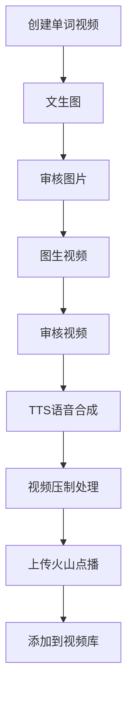
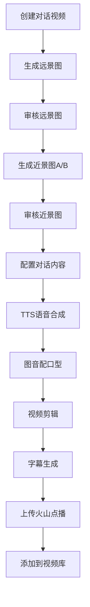

# AIGC视频生成系统

## 概述

基于火山引擎AI能力的视频生成系统，支持单词类和对话类视频的智能生成。

## 技术架构

### 火山引擎AI服务

1. **文生图服务**
   - 模型：`doubao-seedream-3-0-t2i-250415`
   - 尺寸：720x1280
   - 支持同步生成

2. **图生图服务**
   - 模型：`doubao-seededit-3-0-i2i-250628`
   - 用于生成角色近景图
   - 支持同步生成

3. **图生视频服务**
   - 模型：`doubao-seedance-1-0-pro-250528`
   - 异步生成，需要轮询获取结果

4. **对口型服务**
   - 使用火山引擎视觉服务
   - 异步生成，需要轮询获取结果

5. **TTS语音合成**
   - 支持多种音色类型
   - 可调节语速比例
   - 同步生成

6. **字幕生成服务**
   - 支持多语言
   - 异步生成，需要轮询获取结果

## 功能模块

### 1. 单词视频生成流程



**关键步骤：**
1. **基础信息输入**：系列名称、视频标题、单词、提示词
2. **AI图片生成**：使用提示词生成学习图片
3. **AI视频生成**：基于图片生成动态视频
4. **TTS处理**：单词语音合成
5. **最终合成**：视频+音频+单词文字合成
6. **上传发布**：上传到火山点播并添加到视频库

### 2. 对话视频生成流程



**关键步骤：**
1. **基础信息输入**：系列名称、视频标题、远景图提示词
2. **远景图生成**：使用文生图生成场景背景
3. **近景图生成**：基于远景图生成两个角色的近景图
4. **对话配置**：设置角色对话内容、音色、语速
5. **视频生成**：TTS转换、对口型处理、视频剪辑
6. **字幕处理**：自动生成多语言字幕
7. **上传发布**：上传到火山点播并添加到视频库

## 数据模型

### AIGCWord (单词视频)

```typescript
interface AIGCWord {
  id: string;                    // 视频ID
  title: string;                 // 视频标题
  status: AIGCWordStatus;        // 生成状态
  word: string;                  // 单词内容
  ai_gen_img_url?: string;       // AI生成的图片URL
  ai_gen_video_url?: string;     // AI生成的视频URL
  play_url?: string;             // 播放地址
  cover_url?: string;            // 封面地址
}
```

### AIGCDialog (对话视频)

```typescript
interface AIGCDialog {
  id: string;                           // 视频ID
  title: string;                        // 视频标题
  status: AIGCDialogStatus;             // 生成状态
  far_img_url?: string;                 // 远景图URL
  detail_a?: AIGCDialogDetail;          // 角色A详情
  detail_b?: AIGCDialogDetail;          // 角色B详情
  final_video_url?: string;             // 最终视频URL
  subtitles?: Record<Language, string>; // 字幕信息
  play_url?: string;                    // 播放地址
  cover_url?: string;                   // 封面地址
}

interface AIGCDialogDetail {
  near_img_url: string;     // 近景图URL
  audio_type: string;       // 音频类型
  audio_ratio: number;      // 语速比例
  text_list: string[];      // 对话内容列表
  video_url_list: string[]; // 视频片段URL列表
}
```

## 状态管理

### 单词视频状态

```typescript
enum AIGCWordStatus {
  IMG_GENERATING = 1,      // 图片生成中
  IMG_REVIEWING = 2,       // 图片审核中
  VIDEO_GENERATING = 3,    // 视频生成中
  VIDEO_REVIEWING = 4,     // 视频审核中
  VIDEO_PROCESSING = 5,    // 视频处理中
  VIDEO_PROCESS_FAILED = 6,// 视频处理失败
  FINISHED = 7            // 已完成
}
```

### 对话视频状态

```typescript
enum AIGCDialogStatus {
  FAR_IMG_GENERATING = 1,    // 远景图生成中
  FAR_IMG_REVIEWING = 2,     // 远景图审核中
  NEAR_IMG_GENERATING = 3,   // 近景图生成中
  NEAR_IMG_REVIEWING = 4,    // 近景图审核中
  DIALOG_GENERATING = 5,     // 对话生成中
  DIALOG_REVIEWING = 6,      // 对话审核中
  VIDEO_PROCESSING = 7,      // 视频处理中
  VIDEO_PROCESS_FAILED = 8,  // 视频处理失败
  FINISHED = 9              // 已完成
}
```

## API接口

### 核心接口

- **单词视频相关**
  - `createAIGCWord()` - 创建单词视频
  - `operateAIGCWordGenImg()` - 生成AI图片
  - `operateAIGCWordGenVideo()` - 生成AI视频
  - `operateAIGCWordGenFinalVideo()` - 生成最终视频

- **对话视频相关**
  - `createAIGCDialog()` - 创建对话视频
  - `operateAIGCDialogGenFarImg()` - 生成远景图
  - `operateAIGCDialogGenNearImg()` - 生成近景图
  - `operateAIGCDialogGenVideo()` - 生成对话视频
  - `tryAIGCDialogAudio()` - 试听音频

- **火山引擎服务**
  - `generateImageFromText()` - 文生图
  - `generateImageFromImage()` - 图生图
  - `generateVideoFromImage()` - 图生视频
  - `generateVideoWithLipSync()` - 对口型
  - `generateTTS()` - TTS语音合成
  - `generateSubtitles()` - 字幕生成

### 轮询机制

由于部分服务为异步处理，系统实现了轮询机制：

```typescript
const pollTaskStatus = async <T>(
  getTaskFn: () => Promise<ApiResponse<T>>,
  checkComplete: (data: T) => boolean,
  interval: number = 2000,
  maxAttempts: number = 30
): Promise<T>
```

## 组件架构

### 核心组件

1. **AIGCVideoManager** - 主管理组件
   - 视频类型选择
   - 流程路由管理

2. **AIGCWordFlow** - 单词视频流程
   - 5步骤完整流程
   - 实时状态展示
   - 进度条显示

3. **AIGCDialogFlow** - 对话视频流程
   - 6步骤完整流程
   - 角色配置管理
   - 音频试听功能

4. **AIGCVideoList** - 视频列表展示
   - 支持类型筛选
   - 视频播放预览
   - 详情查看功能

## 用户交互流程

### 创建单词视频

1. 选择"单词视频"类型
2. 填写基础信息（系列名称、标题、单词、提示词）
3. 系统自动执行生成流程
4. 实时查看生成进度
5. 完成后可查看最终视频

### 创建对话视频

1. 选择"对话视频"类型
2. 填写基础信息和远景图提示词
3. 等待远景图和近景图生成
4. 配置两个角色的对话内容和音色
5. 系统执行完整的对话视频生成
6. 完成后可查看最终视频和字幕

## 部署要求

### 环境依赖

- Vue 3.x
- TypeScript 4.x
- TDesign Vue Next
- 火山引擎 API 访问权限

### 配置项

```typescript
// 火山引擎配置
const huoshanConfig = {
  accessKey: "your_access_key",
  secretKey: "your_secret_key",
  endpoints: {
    textToImage: "/api/v1/huoshan/text-to-image",
    imageToVideo: "/api/v1/huoshan/image-to-video",
    tts: "/api/v1/huoshan/tts",
    // ...其他接口
  }
};
```

## 注意事项

1. **异步处理**：图生视频、对口型等服务为异步，需要实现轮询机制
2. **错误处理**：需要处理生成失败的情况，提供重试机制
3. **资源管理**：生成的临时文件需要及时清理
4. **审核流程**：生成的内容需要通过审核才能继续后续流程
5. **用户体验**：长时间等待时需要提供进度显示和状态反馈

## 扩展性

系统设计支持：
- 新增其他类型的AI视频生成
- 集成更多的AI模型和服务
- 自定义生成参数和配置
- 多语言和国际化支持


